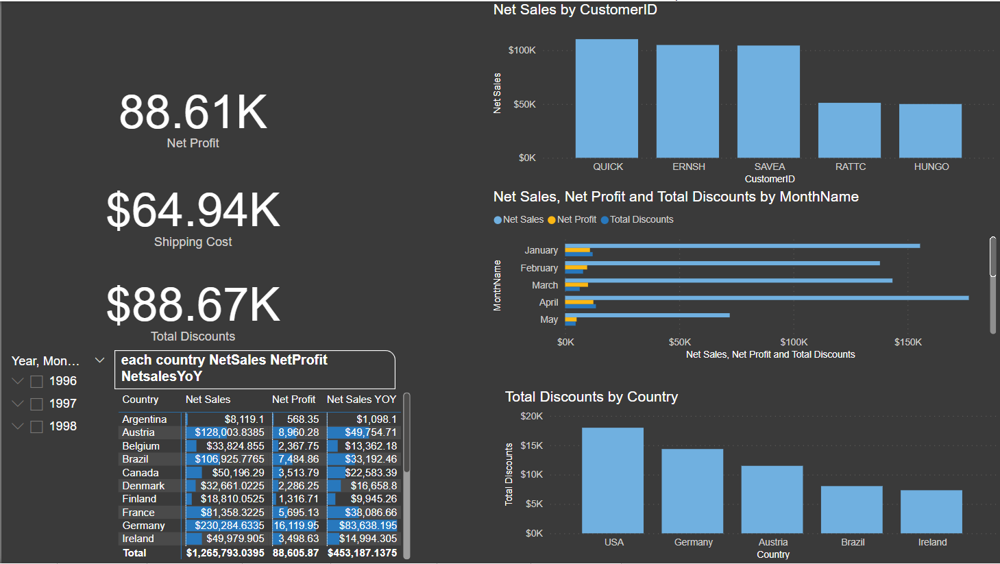

# Northwind Sales Dashboard

## Overview
This repository contains a Power BI dashboard for analyzing data from the Northwind SQL Database. The dashboard covers key business metrics including revenue, customer insights, product performance, employee contributions, and shipping efficiency. This dashboard is designed to help businesses make data-driven decisions based on detailed sales data.

## Features
1. **Overview Report**: High-level metrics such as order count, customer count, and net sales.
2. **Revenue Report**: Analysis of sales, profit, and discount distribution.
3. **Customers Report**: Insights into customer metrics and behaviors.
4. **Products Report**: Performance metrics for products and categories.
5. **Product Performance Report**: Year-over-year sales analysis by product.
6. **Employee Report**: Employee sales performance and order delays.
7. **Shippers Report**: Shipping cost, efficiency, and on-time performance.

## Getting Started

### Prerequisites
- **SQL Server**: Install SQL Server to host the Northwind database.
- **Power BI Desktop**: Download Power BI Desktop to open and interact with the `.pbix` dashboard file.

### Setting Up the Database
1. **Download the Database Backup**:
   - Go to the `database` folder in this repository and download `Northwind.bak`.

2. **Restore the Database in SQL Server**:
   - Open SQL Server Management Studio (SSMS).
   - Right-click on **Databases** > **Restore Database…**.
   - Select **Device** and choose the downloaded `Northwind.bak` file.
   - Follow the prompts to restore the database.

3. **Run the SQL Script**:
   - In SSMS, open the `NorthwindDataQueries.sql` file (included in this repository).
   - Run the script to set up any views or tables needed for the Power BI dashboard.

### Connecting Power BI to SQL Server
1. Open `NorthwindSalesDashboard.pbix` in Power BI Desktop.
2. Go to **Transform Data** > **Data Source Settings**.
3. Update the SQL Server connection to point to your own SQL Server instance.
4. Refresh the data in Power BI to view the latest metrics.

## Dashboard Pages

### 1. Overview Report
   - **Purpose**: Provides a quick snapshot of overall sales and shipping performance.
   - **Metrics Displayed**:
     - Order Count: Total number of orders.
     - Customer Count: Number of unique customers.
     - Net Sales: Total revenue generated.
     - Average Days to Ship: Average time for orders to be shipped.
   - **Visualizations**: 
     - Bar chart showing net sales by CustomerID.
     - Monthly net sales trend.
     - Geographic map displaying sales distribution by country and city.

### 2. Revenue Report
   - **Purpose**: Offers insight into revenue, profit, and discounts by customer and time.
   - **Metrics Displayed**:
     - Net Sales: Total sales revenue.
     - Net Profit: Total profit after deductions.
     - Total Discounts: Cumulative discounts provided to customers.
   - **Visualizations**:
     - Sales, profit, and discounts by month.
     - Top 5 customers by sales.
     - Discount distribution by country.

### 3. Customers Report
   - **Purpose**: Analyzes customer demographics and spending patterns.
   - **Metrics Displayed**:
     - Average Net Sales, Profit, and Shipping Cost per customer.
   - **Visualizations**:
     - Customer count by country and year.
     - New vs. repeat customer analysis.

### 4. Products Report
   - **Purpose**: Displays product performance, including net sales by product and profitability by category.
   - **Visualizations**:
     - Top-selling products by revenue.
     - Category performance comparison.

### 5. Product Performance Report
   - **Purpose**: Year-over-year sales and net profit comparison by product.
   - **Visualizations**:
     - Matrix showing YOY sales changes and profitability by product.

### 6. Employee Report
   - **Purpose**: Summarizes employee performance in terms of sales generated and order delays.
   - **Metrics Displayed**:
     - Net Sales per Employee.
     - Average Orders per Employee.
   - **Visualizations**:
     - Sales and order count by employee.
     - On-time vs. delayed orders per employee.

### 7. Shippers Report
   - **Purpose**: Evaluates shipping performance, focusing on costs, delays, and on-time delivery by company.
   - **Metrics Displayed**:
     - Shipping Cost per Order.
     - On-time Delivery Rate.
   - **Visualizations**:
     - Shipping costs by country.
     - Shipping performance by company.

## Screenshots
Here are some screenshots of the dashboard for reference:
- **Overview**: 
- **Revenue**: 
- **Customers**: 
- **Products**: 
- **Product Performance**: 
- **Employee**: 
- **Shippers**: 

## License
This project is licensed under the MIT License.

